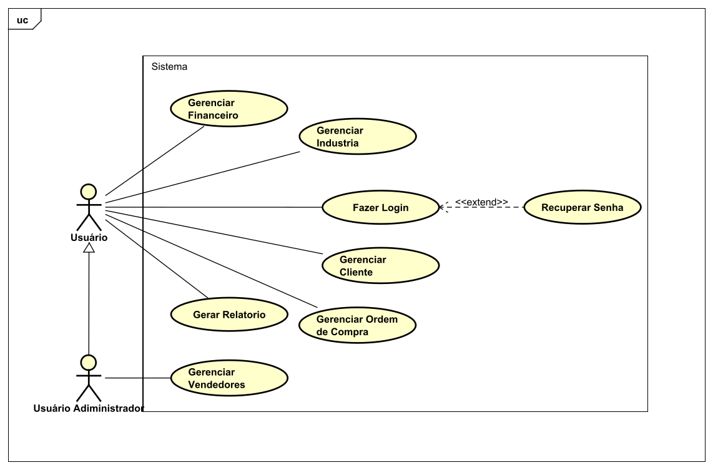
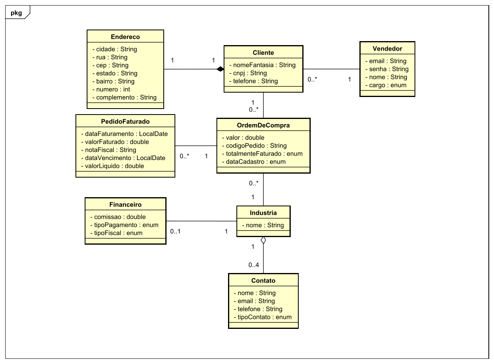

# Artefatos do projeto

Este diretório mantém os artefatos do projeto.

Liste os artefatos produzidos, com suas localizações e descrição do conteúdo.

### Reuniões

- [Ata da 1° reunião ](./atas/Ata1reuniao.pdf) Ata da primeira reunião com o cliente realizada no dia 25 de fevereiro de 2024

- [Ata da 2° reunião ](./atas/Ata2reuniao.pdf) Ata da segunda reunião com o cliente realizada no dia 28 de fevereiro de 2024

- [Ata da 3° reunião ](./atas/Ata3reuniao.pdf) Ata da terceira reunião com o cliente realizada no dia 28 de marco de 2024

- [Ata da 4° reunião ](./atas/Ata4reuniao.pdf) Ata da quarta reunião com o cliente realizada no dia 15 de abril de 2024
- [Ata da 5° reunião ](./atas/Ata5reuniao.pdf) Ata da quinta reunião com o cliente realizada no dia 25 de abril de 2024

### Diagrama de Entidade e Relacionamento

- [DER implementado ](./DER/DER.pdf)

### Interfaces de Usuário

A seguir estarão os documentos referentes as interfaces criadas

- [Esqueci Minha Senha ](userInterface/InterfacedeusuarioEsqueciminhasenha.pdf)

- [Tela Vendedor ](userInterface/InterfacedeusuarioTelaVendedor.pdf)

- [Cadastrar/Atualizar Vendedores ](userInterface/InterfacedeusuarioCadastroVendedor.pdf)

- [Tela Industria ](userInterface/InterfacedeusuarioTelaIndustria.pdf)

- [Cadastrar/Atualizar Industrias ](userInterface.pdf)

- [Tela Financeiro ](userInterface/InterfacedeusuarioTelaFinanceiro.pdf)

- [Cadastrar/Atualizar Financeiro ](userInterface/InterfacedeusuarioRegistroFinanceiro.pdf)

- [Tela Cliente ](userInterface/InterfacedeusuárioTelaCliente.pdf)

- [Tela Ordem de Compra ](userInterface/ordemDeCompra/InterfaceDeUsuárioOrdensDeCompra.pdf)

- [Cadastrar/Atualizar Ordem de Compra ](userInterface/ordemDeCompra/InterfaceDeUsuárioCadastrar_EditarOrdemDeCompra.pdf)

- [Tela Pedido Faturado ](userInterface/pedidoFaturado/InterfaceDeUsuárioPedidoFaturado.pdf)

- [Cadastrar/Atualizar Pedido Faturado ](userInterface/pedidoFaturado/InterfaceDeUsuárioCadastrar_EditarPedidoFaturado.pdf)

### Diagrama de caso de uso

### Diagrama de classes

### Caso de Uso descritivo

[Importação de clientes](CasoDeUsoDescritivo/CasoDeUsoDescritivo_ImportDeCliente.pdf)

[Gerenciar Ordens de compra](CasoDeUsoDescritivo/CasoDeUsoDescritivo-GerenciarOrdemDeCompra.pdf)
